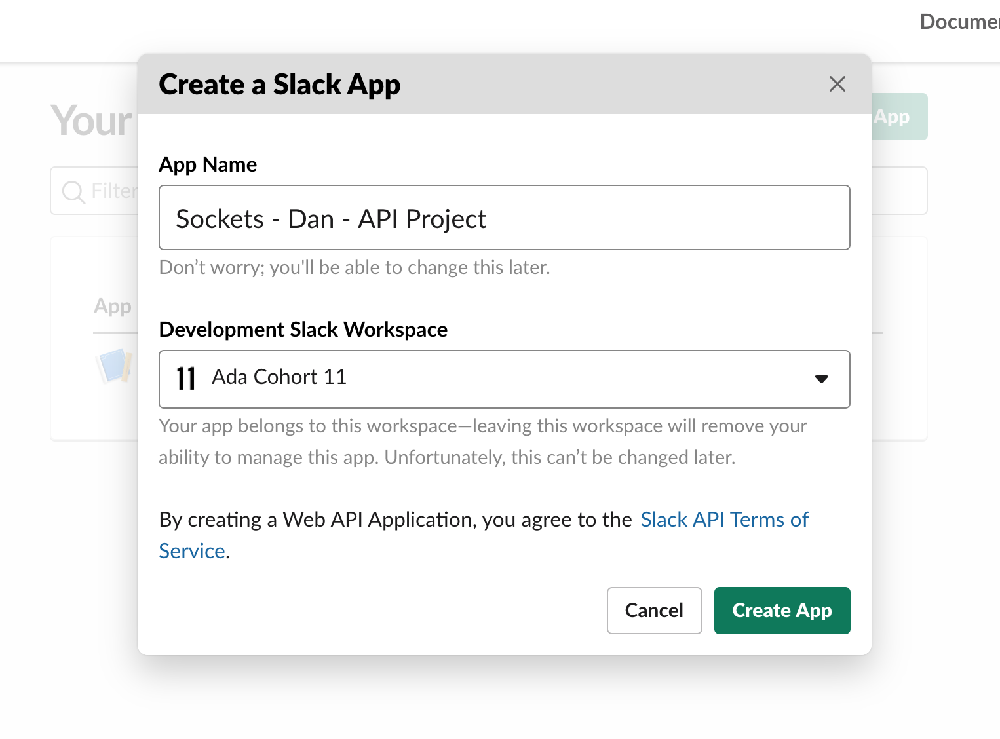
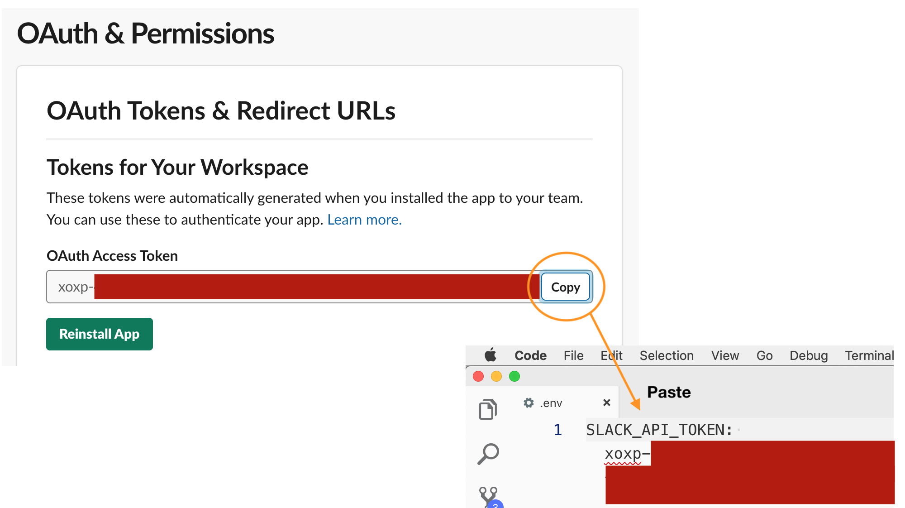

# Project Title

## At a Glance

- Pair, [stage 2](https://github.com/Ada-Developers-Academy/pedagogy/blob/master/rule-of-three.md#stage-2) project
- Due EOD Friday, *DATE HERE*

## Introduction

Set any context/content that needs to be introduced. Examples include:
- Adagrams needed an introduction to anagrams and game shows
- Exquisite React needed an introduction to Exquisite Corpse

## Learning Goals

- Sending requests to and receiving responses from an API
- Working with data from an external source
- Mocking an external dependency during testing
- Designing and implementing a program using inheritance

## Objective

We will write a complete command-line application that interacts with Slack. This application will allow a user to list users and channels, see details about a user or channel, and send a message to a user or channel.

## Getting Started

This section sometimes has subheaders (h3) about different components that need to be set up, read through, and/or understood before beginning. Some examples include:

- Directions about reading through the waves
- Explanation about the scaffolded code
- Suggestions about making a strategy

It could also include one-time instructions or commands to keep handy, such as:

- Clone the repo
- Install via ...
- Seed the database via ...
- Run the project via ...
- Run tests via ...

For example, Adagrams has the following h3s:

- Tests
- Pair Programming
- Driver Code

## Setup Requirements

In order to interact with the Slack API, you will need to set up an _authentication token_. To do so, follow these steps.

1. Go to https://api.slack.com/apps
    - You might have to sign in using your Slack credentials
1. Click the green `Create New App` button
1. Fill out the details in the modal window
    - For the name of your app use `ClassName - YourName - API Project`
    - For the workspace, use the Slack workspace for your cohort

    
    - Click the green `Create App` button
1. Click `Add features and functionality`, then `Permissions`
1. Scroll down to `Scopes`, and add the following three permissions:
    - `chat:write:bot`
    - `channels:read`
    - `users:read`

    
    - Click the green `Save Changes` button
1. Install and authorize the app:
    - Scroll to the top of the page and click the green `Install App to Workspace` button
    - Check that your app's permissions are correct and click the green `Authorize` button

    
1. You should now see an `OAuth Access Token`. Copy this and paste it into your app's .env file.
    

## Implementation Requirements

### Wave 1

Could have Wave 1 details. Ideally/depending on timing, details will be in User Story format ( As a < type of user >, I want < some goal > so that < some reason >. )

### Wave 2

Could have Wave 2 details.

### Optional: Wave X

Could have details about an optional wave.

## Functional Requirements

Based on where students are in the curriculum, projects will either have "Implementation Requirements" or "Functional Requirements"

### Wave 1

Could have Wave 1 details. Ideally/depending on timing, details will be in User Story format ( As a < type of user >, I want < some goal > so that < some reason >. )

### Wave 2

Could have Wave 2 details.

### Optional: Wave X

Could have details about an optional wave.

## Non-Functional Requirements

These requirements are not tied to features/feature-development.

## Optional Enhancements

Sometimes there are a list of optional enhancements that aren't necessarily in the form of a wave, but a list:

- Lorem ipsum
- Dolor sit amet

## What Instructors Are Looking For
Check out the [feedback template](feedback.md) which lists the items instructors will be looking for as they evaluate your project.
