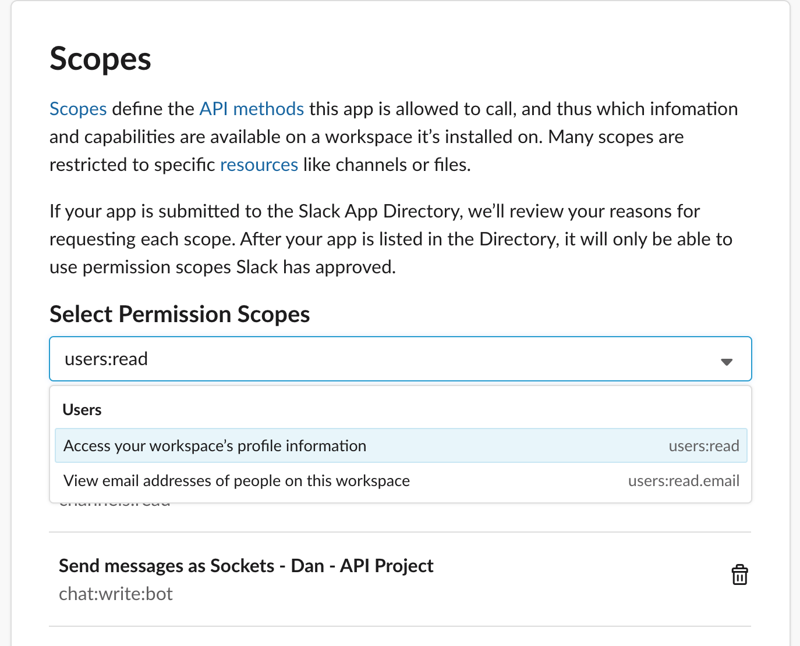

# Slack Auth Setup

## Steps

In order to interact with the Slack API, you will need to set up an _authentication token_. This token will not be shared, so **both partners must follow these steps**.

1. Go to https://api.slack.com/apps
    - You might have to sign in using your Slack credentials
1. Click the green `Create New App` button
1. Fill out the details in the modal window
    - For the name of your app use `ClassName - YourName - API Project`
    - For the workspace, use the Slack workspace for your cohort

    
    - Click the green `Create App` button
1. Click `Add features and functionality`, then `Permissions`
1. Scroll down to `Scopes`, and add the following three permissions:
    - `chat:write:bot`
    - `channels:read`
    - `users:read`

    
    - Click the green `Save Changes` button
1. Install and authorize the app:
    - Scroll to the top of the page and click the green `Install App to Workspace` button
    - Check that your app's permissions are correct and click the green `Authorize` button

    
1. You should now see an `OAuth Access Token`. Copy this and paste it into your app's `.env` file.
    
    - The `.env` file should already be in the provided `.gitignore`, but it doesn't hurt to double check!

Your application should now be able to access Slack!

## Verification

To verify that you've set up the slack token correctly, work with your partner to write a script that does the following:

1. Use the `dotenv` gem to load environment variables
1. Use HTTParty to send a GET request to the [`channels.list` endpoint](https://api.slack.com/methods/channels.list)
1. Check that the request completed successfully, and print relevant information to the console if it didn't
1. Loop through the results and print out the name of each channel

If your tokens are set up correctly, each of you should be able to run this script.